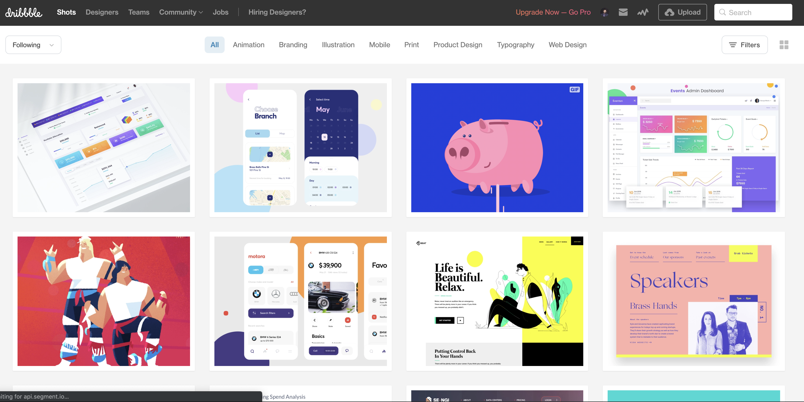

As discussed in my previous post I started doing the Pirple SaaS Masterclass. I planned to write blog posts as I follow along with it and keep it as my notebook and also help people to read it :) 

Pirple SaaS masterclass's first video is about 30min. It covers the following-

**1. What is a SaaS**

**2. How to generate ideas**

**3. Some warnings**

**4. A dozen free ideas (they are pretty reasonable)**

**5. Assignment- Write down the 3 ideas I have chosen**

### What is a SaaS?

A business whose primary user experience is browser or API based and monetizes by:

 - One time or Subscription fees
 - Revenue through ads
 - Comission on transaction fees

 Note there are more models also like ecommerce sites. But in the Pirple SaaS Masterclass only the above 3 are covered.

### How to generate Ideas?

 1. **Ask friends about their problems**

 Basically, go to your friends and ask what are the various problematic tasks in their daily life. Dont ask them a product or an idea. Just ask the problem.

1. **Redo an existing SaaS**

 Understand other SaaS products and add a feature which focuses on solving the problem in a better way. Its easy!

1. **Port ideas**

 Take any SaaS, for example Uber and change the vertical. So how about uber for school children or uber for food? Its just an idea but it can be done for all startups.

1. **Find requests/ issues**

 On github, or any product's forum or even twitter people post things they want to see as products or they post issues. Find such issues and make a product which solves the problems.

### Some Warnings

1. Don't do grey hat/ black hat stuff

1. Avoid industries like adult, gambling, drugs/alcohol, get rich quick, banking, etc

1. Don't solve more than one problem or you could mess up everything. 

1. Don't use hackathon challenges( problems)

1. Don't just look for a unique idea! It's good to pick a idea which has a few players already as you understand people are using it already and could use yours too.

#### Links

1. [hackathon.io](https://www.hackathon.io/projects "hackathon.io/projects")
1. [Producthunt](http://producthunt.co "producthunt.co")
1. [dribbble](http://dribbble.com "dribbble.com")
1. [Atlassian Community forum](https://community.atlassian.com/ "community.atlassian.com")

