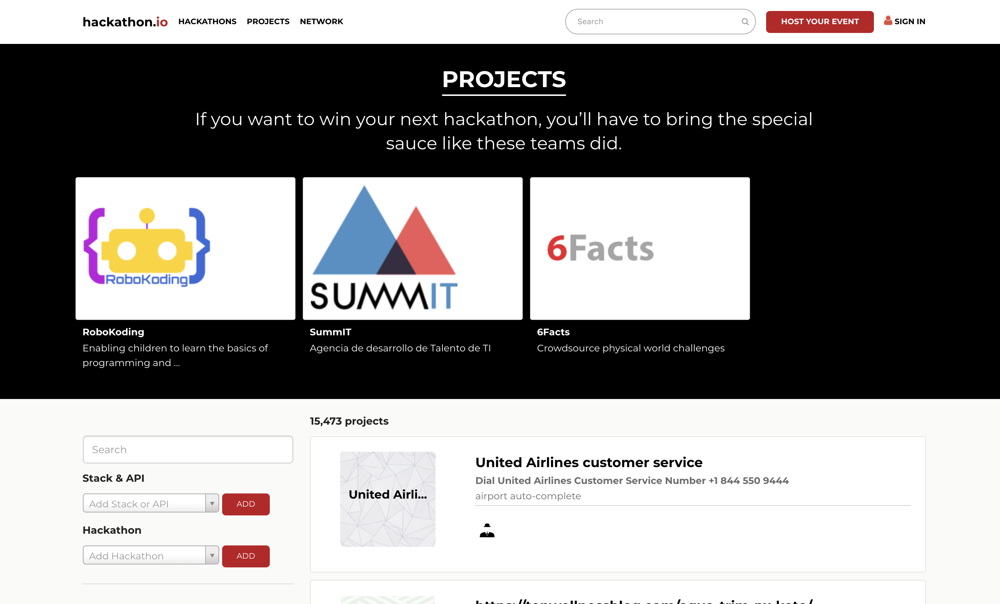

Today, The class is highly knowledgable since I have almost never done any competitor research before. The class is about 20min long and highly informative! The instructor asks to do 3 things-

1. **Competitor Research**

1. **Subject Matter Research**

1. **Technical Research**

### Competitor Research

For Competitior Research, the instructor gives us 30 columns which we need to fill for each competitor, these include 

 - Alexa rank
 - Last updated
 - Website UI
 - Reviews

 ...and much more

I will attach a link to the Excel sheet template for future competitor research.

### Subject Matter Research

For the ideas we have chosen in Day 1- we must understand the subject & the matter correctly and in detail. Just choosing a subject which we hardly understand would be like solving an unknown problem. So we need to become close to subject matter experts down the line. So the instructor asks for researching about the subject and gaining understanding about it. After that we can make a conclusion, can I actually use this idea in a subject which I know nothing about? Or perhaps a subject in which you are already an expert ( UI Design for me) so if I choose an idea related to this it will be better for me as well as the startup.

### Technical Research

Tehnical Research and feasibility is very important for SaaS startups as per the instructor- they obviously are. I am excellent with frontend and full stack development, picking something in an untouched industry would be highly risky and I might have to spend thousands of dollars hiring technical experts doing it for me and there is also a big chance I might not even be able to finish it.

#### Homework

1. Competitor analysis excel sheet for all 3 ideas (in detail because its your own startup!!)

1. Subject Matter Research- Read and understand the idea's subject/matter

1. Technical Research- Do some research and know the technical feasibility of the SaaS application/solution we will be building

That's all for today! Thanks for reading my blog
