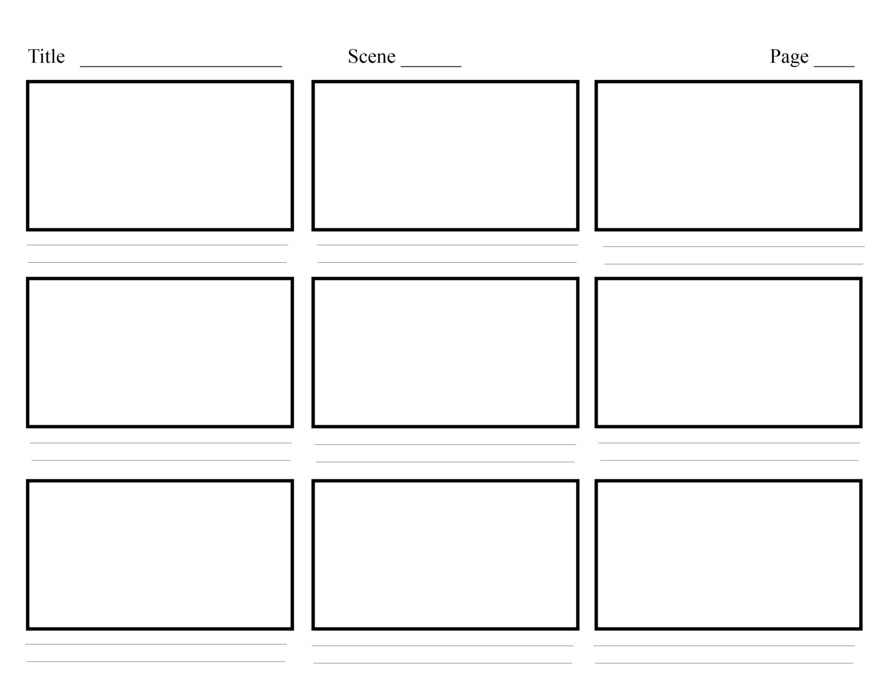

We all want to get into doing the Logo, branding and the beautiful looking part as its tempting. But stop right there, we need to plan and basically draft the UX before anything else whatsoever. So in Day-6  we basically look at why storyboarding is so crucial when doing a SaaS product. The following are the key reasons-

1. **it let's our ideas out quickly**

1. **Making mistakes are a part of the process** - We all make mistakes, the good thing about storyboarding is that no time is wasted as the storyboards are rough sketches.

1. **Focus on the core elements of User experience** - Storyboarding lets us focus on the important aspects of our product and not the non important parts (logo, branding ,colors, etc)

### Story boards- First step in the design process 

1. Whiteboard

1. Paper and pencil

1. Digital

**Storyboard tool used in the lecture**

https://boords.com

## The key to good storyboarding is minimalism

Think about what actions will the user be performing on the site, focus on high value parts of your service only. No need to think about the minute details. Minute details will pull your focus from the bigger picture. Minimalism allows us to focus on the most minimum possible design which just tells what we want to do by removing all the unncessary stuff like auth, reset password, etc

To make your story powerful, here are some points to think about:

- **Authenticity.** The main thing is to make the character, their goal, and what happens in their experience as clear as possible. If you’re writing something that doesn’t resonate with your product, your users will be able to tell. Thus, keep the focus on real humans in real contexts, and your audience will empathise with them.

- **Simplicity.** Cut out any unnecessary extras. No matter how good a sentence, picture, or page may be, if it doesn’t add value to the overall message, you should remove it.

- **Emotion.** It’s essential to communicate the emotional state of your character throughout their experience.

That's all for today! Thanks for reading my blog
