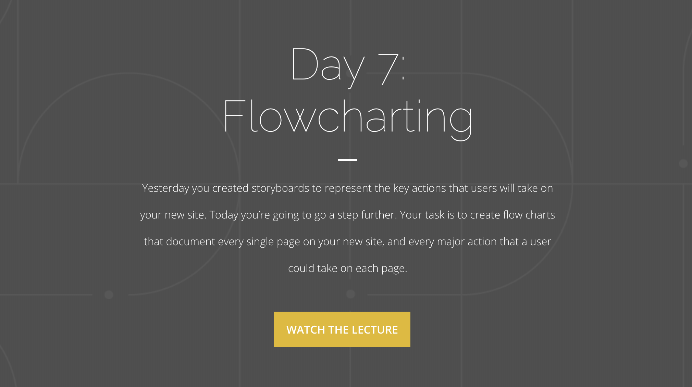
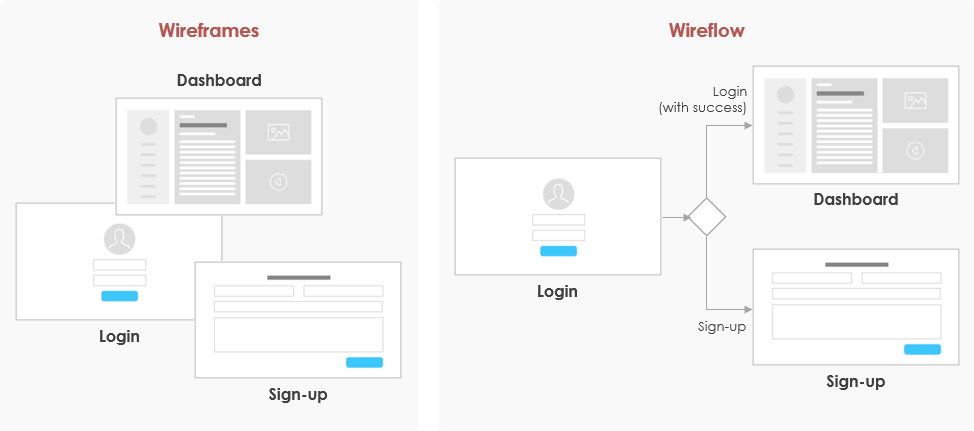

After the last class, we have a storyboard ready for our idea. I myself used my big whiteboard to draw the simple looking storyboard. Now in Today's class we create the flowcharts.

Well, flowcharts include the **flow of the user** as well as **all the different pages** in our web application.

### Flowcharting, in comparison to Storyboarding is a slower process and should be done digitally.

Since flowcharts contain details of the user flow and all the pages in the web application (or any application infact), its a slower process. We need to map out every user action carefully and hence it should be done digitally as in the course.

A UX flowchart helps you visualize the steps a user takes to complete a task or achieve a goal on your site or app (the user flow). Identifying and reflecting on how users navigate your site will help you meet their needs more efficiently.

As with everything UX-related, the better designed your flowchart, the closer you are to building a product that users will love to use. If you’re not already designing flowcharts or flow diagrams, don’t panic.

**Storyboard tool used in the lecture**

https://boords.com

## User Signup Flow-

- **Entering personal info.** User enters their email, password, username, etc

- **Confirming their agreement to our TOS.** User should agree to our Terms and conditions while they signup.

- **Signing up with Google/FB/Twitter, etc.** It’s essential to include these social media SSO providers as they make the signup process less time consuming and smooth.

- **Confirm email address** User confirms their email address post signup

- **Adding 2FA via QR or Google Authenticator or SMS** Its a good practice to include 2FA via Google Authenticator to prevent hacks/compromises from user side.

Flow-charts are used in many fields, not just UX; and sometimes people use fancy terms such as “business process maps” for this instead. But it seems to me that the terminology used is nothing more than a function of emphasizing the purpose of the flow-chart. So if you call it a “User flow-chart” then it sounds like you are focussed on the user, while a “business process map” obviously focusses on the business. Try not to get bogged down by the terminology.

That's all for today! Thanks for reading my blog
