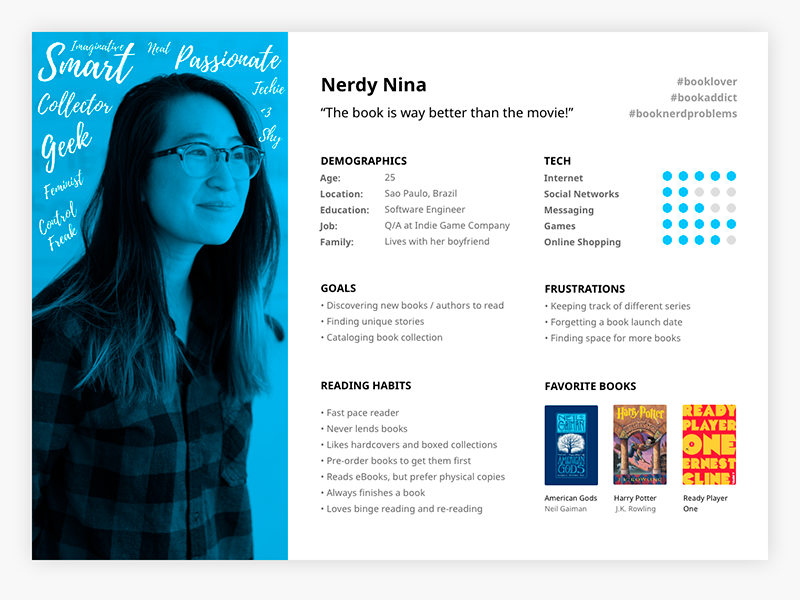

Yesterday we found out the compeititon and did a basic analysis of our competitors, technical feasibility and subject matter knowledge of all 3 ideas from Day 1. Today we start with finding and understanding our end users(customers).

### Creating in-depth Profiles of potential customers

So now we need to find our potential customers who will be using the apps (ideas). There are a few techniques as taught in the class. This includes -

1. **Google Keyword Planner**

1. **Facebook Analysis**

1. **Google Trends**

1. **Alexa Website data**

1. **Similar Site data**

Example of what we have to do as a homework. 

Note- the picture below is just an example, but most importantly we need to understand and write the descriptions so that later we can use it to streamline and quantitatively make important decisions.

That's all for today! Thanks for reading my blog
